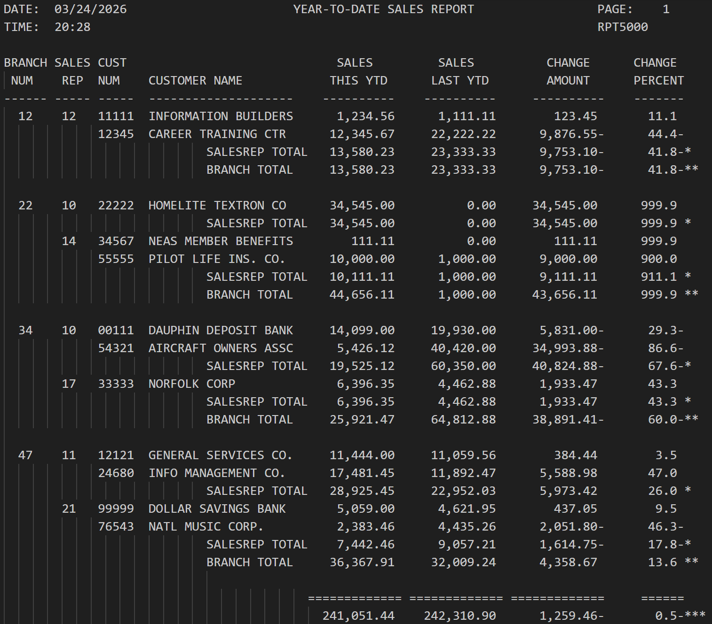

# RPT 5000
 

---

## 👤 Author
Ben Stearns - [@bstearns07](https://github.com/bstearns07)

---

## 📑 Table of Contents
- [📌 Summary](#-summary)
- [✨ Features](#-features)
- [🧾Report Breakdown](#-report-breakdown)
- [⚙️ How It Works](#how-it-works)
- [🧰 Tech Stack](#-tech-stack)
- [🧠 Topics Covered](#-topics-covered)
- [📘 What I Learned](#-what-i-learned)
- [🖼 Screenshots](#-screenshots)

---

## 📌 Summary

The **Report 5000** application demonstrates how to generate a clean sales report in enterprise COBOL. In this version of the program, you now have less repetitive text creating noise so the final report comes out super clean. Also, sales representative totals are now calculated for your viewing
pleasure and code utilizes more standard COBOL features. Take a look!

For full program details, refer to [Program Requirements](./assets/Assignment_Instruction.pdf) 

---

## ✨ Features

- Sorted by branch number and sale representive number
- Customer sales totals by this year-to-date, last-year-to-date, change amount, and chance percent
- Final totals across all customer for this year-to-date, last-year-to-date, change amount, and chance percent
- (new) Both branch AND sale representative sale totals
- (new) More standadized COBOL coding syntax
---

## 🧾 Report Breakdown

### 📊 Report Fields Overview
| Field | Description |
|------|-------------|
| 🏢 Branch | The branch that handled the sale |
| 👤 Sales Rep | The representative responsible for the sale |
| 🆔 Customer Number | Unique ID assigned to the customer |
| 📛 Customer Name | Name of the customer |
| 💰 Sales This YTD | Total sales for the current year-to-date |
| 📉 Sales Last YTD | Total sales for the previous year-to-date |

---

### 📈 Calculated Metrics
| Metric | Description | Formula |
|-------|------------|---------|
| 💵 Change Amount | Difference between current and previous YTD sales | `Sales This YTD - Sales Last YTD` |
| 📊 Change Percent | Percentage change between current and previous YTD sales | `(Change Amount * 100) / Sales Last YTD` |

---

### ⚠️ Special Case Handling
| Condition | Behavior |
|----------|----------|
| 🚫 Sales Last YTD = 0 | Change Percent is set to `999.99` to avoid division by zero |
---
## 🧰 Tech Stack

- Enterprise COBOL 6.4 (Semantic Markup)
- IBM z/OS mainframe for development and compiling
- ZOWE Explorer Studio Code extension

### 🧩 Core Concepts
- Report generation with standard alignments
- Reading data in from another mainframe member
- Proper setup of Environment and Data divisions for reading in data from other members
- Arithmatic with modern COBOL coding syntax such as EVALUATE (TRUE), conditional switch, and WITH TEST AFTER statements

### 🛠 Development Tools
- Marist z/OS Mainframe environment
- Visual Studio Code with ZOWE Explorer extension

---
## How It Works

1. Upload the repository's associated .cbl, .jcl and CUSTMAST data members to your mainframe environment
2. Modify the JCL username on line 1 and the DSN names to match the filepaths for where the members are in your environment
3. Sumbit the JCL job for processing

---

## 🧠 Topics Covered

### 📊 COBOL Fundamentals
| Skill | Description |
|------|-------------|
| 🧮 Arithmetic Processing | Performing calculations for sales totals and accumulations |
| 🔁 Looping Logic | Using `PERFORM UNTIL` and `WITH TEST AFTER` for controlled iteration |
| 🔀 Conditional Logic | Implementing `EVALUATE (TRUE)` and conditional switches |
| 🧱 Program Structure | Proper `ENVIRONMENT` and `DATA DIVISION` construction |

---

### 📁 File & Data Handling
| Skill | Description |
|------|-------------|
| 📥 File Input | Reading data from an external member/file |
| 🔄 Data Comparison | Detecting changes between control fields (e.g., Sales Rep breaks) |

---

### 🧾 Reporting & Output
| Skill | Description |
|------|-------------|
| 📊 Report Generation | Producing formatted reports with consistent alignment |
| 📅 Date & Time | Retrieving and displaying system date/time in reports |

---

### ⚙️ JCL & Execution
| Skill | Description |
|------|-------------|
| 🛠️ JCL Integration | Writing an associated JCL job member for compile, link, and execution |

---

## 📘 What I Learned

In this version of the report program, I learned a lot about taking existing code and refining it into more concise and easier-to-read code 
using some of the more intuitive standards COBOL offers. I really like how you could use PERFORM TRUE statements to simulate a swith (true)
statement to help clean up excessive if-else logic that's hard to follow. I also learned how you can use conditional switches to simulate boolean 
values to make coding logic more semantic and easier to interpret. This program easily leveled up my COBOL game to something that easier to 
understand.

---

## 🖼 Screenshots

### 🖼 Final Report

⬆️ [Back to Top](#-smartwatch-faq)
